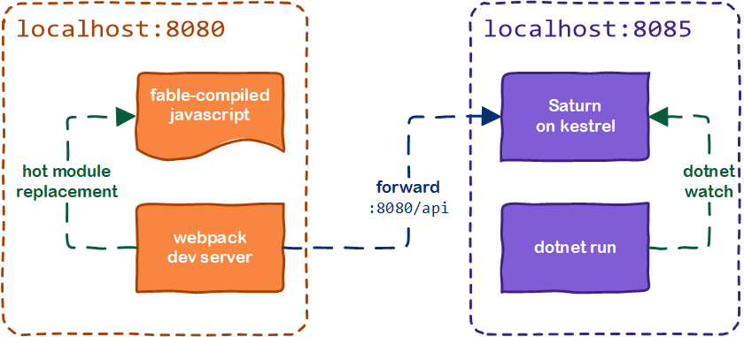
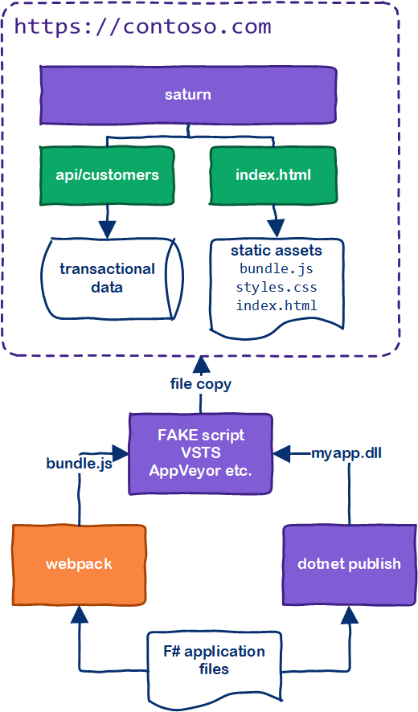

Support for moving from development to production with SAFE applications is included "out of the box" when using e.g. [Azure](template-appservice.md) or [Docker](template-docker.md) deployment options. Nonetheless, this page explains the key differences that you should be aware of between running SAFE applications in development and production.

## Developing SAFE applications
The SAFE template is geared up towards a streamlined development process. Firstly, it contains a [FAKE build script](template-fake.md) which you can use this to quickly download dependencies, as well as build and run both the client and server on your machine.

The development process uses *two web servers* running in tandem:

* The "back-end" .NET web server which hosts your API endpoints and other server-generated content. This uses Kestrel on ASP .NET out of the box (although you can opt for [other options](https://docs.microsoft.com/en-us/aspnet/core/fundamentals/servers)).
* A "front-end" web server which hosts your Fable application. The SAFE template uses the [Webpack Dev Server](https://github.com/webpack/webpack-dev-server) for this.

The backend build makes use of `dotnet watch` to allow you to make changes to your server-side application and have the server automatically restart with the latest changes. Since your back-end applications will typically be stateless, this permits a rapid development workflow.

On the client side, your code is compiled using webpack. This provides many benefits for working with javascript, such as minification and bundling, as well as [hot module replacement](feature-hmr.md), a feature made possible when using the webpack dev server. This means that you can continually make changes to your client application code and can rapidly see the results reflected in your browser, without the need to fully reload the application.

### Webpack Dev Server
It's important to note that the webpack dev server is configured to automatically route traffic intended for `api/*` routes to the back-end web server. This *simulates* how a SAFE application might work in a production environment, with both client and server assets served from a single web server. This also allows you to not worry about ports and hosts for your backend server in your client code, or [CORS](https://developer.mozilla.org/en-US/docs/Web/HTTP/CORS) issues. You can find out more about the configuration of the webpack dev server in SAFE [here](template-webpack.md).

## Running SAFE applications in production
In a production environment, you won't typically use the webpack dev server. Instead, it's more common to use webpack as a one-off compiler step to create your bundled javascript from your Fable app (plus dependencies), and then deploy this along with your back-end web server which also hosts that content directly. For example, you can use Saturn to host the static content required by the application e.g. HTML, JS and CSS files etc. as well as your back-end APIs. This fits very well with standard CI / CD processes, as a build step in your FAKE script or VSTS / AppVeyor / Travis step etc.

All [deployments options](template-overview.md#deploy) do this automatically.

### Client asset hosting alternatives

Rather than hosting your client-side content and application inside your web server, you can opt to host your static content from some other service that supports hosting of HTTP content, such as Azure Blobs, or a content hosting service. In such a case, you'll need to consider how to route traffic to your back-end API from your client application (as they are hosted on different domains), as well as handle any potential CORS issues.