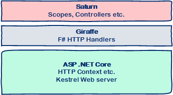

## Server-side options in SAFE

The [SAFE template](safe-template) comes with three alternative server technologies out of the box:

* **Saturn** - A simple, flexible F# abstraction layer that runs on top of Giraffe that enables both MVC- and Web API-style services. 
* **Giraffe** - A flexible F# framework for creating web-enabled applications. Giraffe runs on top of ASP .NET Core and the Kestrel server.

Saturn, which lives "on top" of Giraffe, provides a set of new higher-level abstractions which delegate down to Giraffe's HTTP Handler.

| | Saturn | Giraffe |
|-|:-:|:-:|
| ASP .NET compatible? | Yes | Yes |
| F#-first? | Yes | Yes |
| Core Abstractions | scope, controller and HttpHandler | HttpHandler |

## Why Saturn?
** Saturn is the default and recommended web server in SAFE**.

Saturn (and Giraffe) runs on top of ASP .NET Core, which comes with an extremely high-performance server that is fully supported by Microsoft, has a huge community of developers and has excellent integration into cloud services such as Microsoft Azure and Amazon Web Services.

In addition, whilst the Giraffe programming is extremely composable and fully functional-first, Saturn allows you to take advantage of abstractions such as `application { }`, `scope { }` and `controller { }` which are not only extremely simple to use but will also be familiar to developers from other (non-.NET) web programming models. And since Saturn's abstractions are all *optional*, you can always fall back directly to the lower-level Giraffe model if required.

## Coming from Suave?
Giraffe's HTTP Handler is a very similar abstraction to that of the Suave web server, which means that you can easily migrate over to Giraffe (and Saturn) and quickly start to benefit from the features that ASP .NET, Giraffe and Saturn all provide.