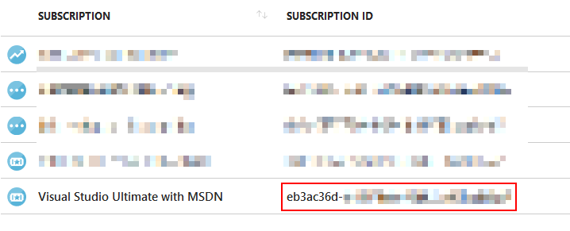
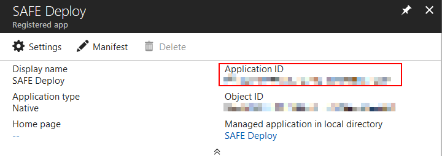

In order to deploy applications to Azure from the FAKE script created by the FAKE template, you first need to create an Azure account and create an App Registration which allows remote deployments as a one-off task. This section explains how to do this.

## Creating an Azure Account

You'll need to register for an Azure account. This can be achieved quickly and easily at https://azure.microsoft.com. New users are afforded a number of services for free for an entire year, including Azure SQL, Storage and VMs etc.

## Selecting the Subscription
Once you have created your account, you'll need to select an Azure Subscription to deploy your SAFE applications into.

1. Log in to your [Azure Portal](https://portal.azure.com).
1. Select All Services on the left-menu menu and locate **Subscriptions** in the blade on the right.

1. Make a note of the **Subscription ID** of the subscription that you wish to deploy your application into. If you just created your Azure account, you'll most likely have a single subscription in the list.

### Creating an App Registration
You'll now need to create an "App Registration" in your Azure Active Directory. This registration allows you to deploy an entire environment directly into Azure, complete with the deployed application, directly from a FAKE script.

1. Navigate to the **Azure Active Directory** blade in the Portal.
1. Select **App registrations** from the menu in the blade.
1. Select **New application registration**.

1. Enter the **Name** of your application as any name e.g **SAFE Deploy**
1. Set the **Application type** as **Native**.
1. Set the Redirect URI as any URI e.g `http://safe-stack.github.io/`
1. Hit Create.
1. Make a note of the **Application ID** on the blade.

1. Choose **Settings** from the top menu.
1. Choose **Required Permissions** from the Settings blade.
1. Choose **Add** from the top menu of the Required Permissions blade.
1. Choose **Select an API** from th Add API Access blade.
1. Choose **Windows Azure Service Management API** and hit **Select**.
1. Check **Access Azure Service Management as organization users (preview)** and hit **Select**.
1. Hit **Done** from the Add API Access blade.

Congratulations - you're now ready to use the SAFE FAKE template to perform remote deployments.